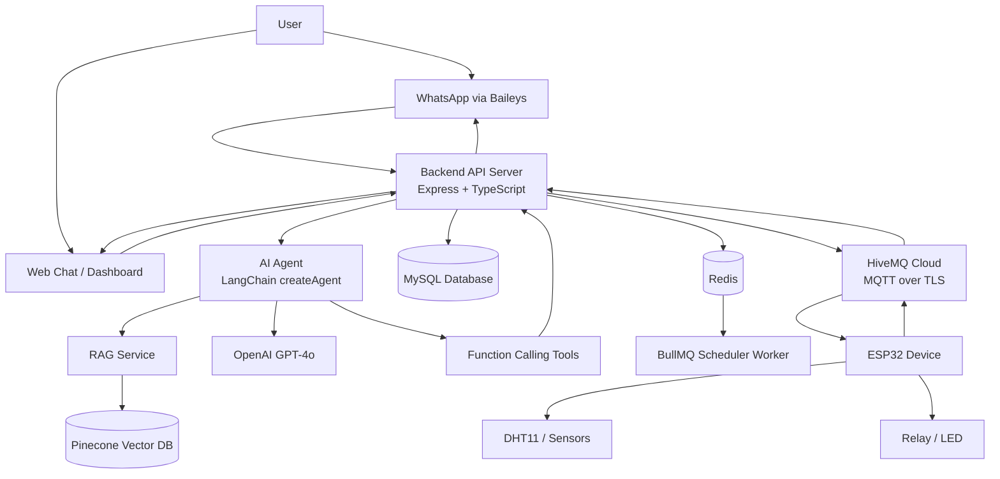
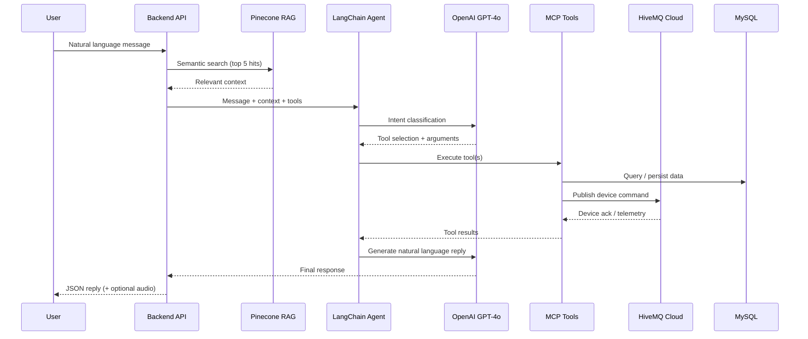

# AI Agent IoT Platform — Backend API

<p align="center">
  <strong>Natural Language-Based IoT Control and Monitoring System Powered by Large Language Models</strong>
</p>

<p align="center">
  REST API backend for controlling, monitoring, and automating IoT devices through natural language — via WhatsApp and a web-based chat interface.
</p>

<p align="center">
  
  
  
  
  
  
  
  
  
</p>

---

## Table of Contents

- [Overview](#overview)
- [Why This Project Exists](#why-this-project-exists)
- [Key Features](#key-features)
- [Demo Commands](#demo-commands)
- [System Architecture](#system-architecture)
- [How It Works](#how-it-works)
- [Technology Stack](#technology-stack)
- [Core Modules](#core-modules)
- [Project Structure](#project-structure)
- [Getting Started](#getting-started)
- [Docker Setup](#docker-setup)
- [Environment Variables](#environment-variables)
- [MQTT Topic Design](#mqtt-topic-design)
- [API Overview](#api-overview)
- [AI Agent Workflow](#ai-agent-workflow)
- [LLM Evaluation](#llm-evaluation)
- [Security Notes](#security-notes)
- [Research Context](#research-context)
- [Disclaimer](#disclaimer)
- [License](#license)
- [Author](#author)

---

## Overview

**AI Agent IoT Platform — Backend API** is the server-side component of an intelligent Internet of Things system. It allows users to control, monitor, and automate electronic devices using natural language.

Instead of fixed buttons, predefined commands, or complex dashboard menus, users can simply type commands such as:

```text
Turn on the living room light
What is the current temperature?
Turn off all devices
Turn on the fan every day at 6 PM
Schedule sensor reading tomorrow at 8 AM
```

The backend uses a **Large Language Model (LLM) AI Agent** to understand user intent, select the correct tool, retrieve relevant device context, and execute actions on IoT devices through **MQTT (HiveMQ Cloud)**.

This backend combines:

- Large Language Models (OpenAI GPT-4o)
- AI Agent workflows with function calling
- Retrieval-Augmented Generation (Pinecone)
- MQTT communication (HiveMQ Cloud)
- WhatsApp chat interface (Baileys)
- Web-based chat API with optional TTS
- Device management & telemetry logging
- Scheduler automation (BullMQ + Redis)
- Admin & user management
- Swagger API documentation

> **Repository layout:** all application source code lives in the [`CORE/`](./CORE/) directory. This README describes the backend service as a whole; follow the setup steps below from `CORE/`.

---

## Why This Project Exists

Most conventional IoT systems require users to interact through rigid interfaces, predefined buttons, or strict command formats. This approach becomes less flexible as the number of devices grows.

This project introduces a more natural interaction model where users communicate with IoT devices using everyday language.

The main goal is to make IoT systems:

- Easier to use
- More flexible
- More context-aware
- More intelligent
- More accessible for non-technical users

The backend serves as the **central orchestration layer** between user interfaces (WhatsApp, web chat, admin dashboard), the AI Agent, the database, and physical IoT devices.

---

## Key Features

### Natural Language Device Control

Control IoT actuators using conversational commands in Indonesian or English.

```text
Turn on the bedroom light
Matikan relay ruang tamu
Turn off all devices
```

The AI Agent interprets the command and invokes `set_actuator_state_by_device_name`, which publishes an MQTT command to the target device.

---

### Real-Time Sensor Monitoring

Retrieve sensor data and device logs stored from ESP32 telemetry.

```text
What is the latest room temperature?
Show me the last 10 humidity readings
Is the living room light currently on?
```

The agent uses tools such as `get_last_log_by_device_name` and `get_last_10_logs_by_device_name` to fetch data from MySQL and respond in natural language.

---

### AI Agent with Function Calling

The AI Agent uses **LangChain** `createAgent` with structured tool definitions to transform user commands into executable backend actions.

Example flow:

```text
User: Turn on the living room light
```

Structured tool invocation:

```json
{
  "name": "set_actuator_state_by_device_name",
  "arguments": {
    "deviceName": "living_room_light",
    "state": "on"
  }
}
```

The backend validates the call, publishes to MQTT, and returns a human-readable response.

---

### Retrieval-Augmented Generation (RAG)

Relevant context is retrieved from **Pinecone** before each chat turn. Retrieved documents may include:

- Indexed device documentation
- System knowledge base entries
- User-provided text indexed via the Indexing API

This improves answer accuracy for domain-specific questions beyond raw tool output.

---

### Scheduler Automation

Create time-based automation using natural language. Schedules are persisted in MySQL and executed by **BullMQ workers** backed by **Redis**.

```text
Turn on the light every day at 6 PM
Turn off all devices at 11 PM
Fetch sensor data tomorrow at 8 AM
```

Supported schedule types:

| Type | Description |
|------|-------------|
| `once` | One-time execution at a specific datetime (WIB) |
| `repeat` | Daily recurring execution at a fixed hour:minute |

---

### WhatsApp Chat Interface

Users can send IoT commands through **WhatsApp** using natural language. Incoming messages are routed to `ChatService`, and replies are sent back through the Baileys Web session.

Session management endpoints allow connect (QR pairing), status check, and disconnect per user.

---

### Web-Based Chat Interface

The REST chat API (`POST /api/v1/chat`) supports:

- Text-based natural language input
- JWT-authenticated requests
- Optional voice reply via OpenAI TTS (`withAudio: true`)
- TTS preview endpoint for frontend integration

---

### Admin & Device Management

Full CRUD APIs for:

- IoT devices (actuators & sensors)
- Device logs & telemetry history
- Scheduler execution logs
- Application logs
- Admin accounts
- LLM model settings
- Vector index management (Pinecone)

Aggregate statistics are available via the Stats API.

---

## Demo Commands

| Use Case | Example Command | Expected Result |
|----------|-----------------|-----------------|
| Device control | `Turn on the living room light` | Actuator receives MQTT ON command |
| Multi-device query | `List all devices` | Agent calls `list_devices` and returns device list |
| Sensor monitoring | `What is the current temperature?` | Latest sensor log is fetched and summarized |
| Device status | `Show last 10 logs for DHT11 sensor` | Historical readings returned in natural language |
| Scheduler | `Turn off the light every day at 11 PM` | Daily recurring schedule created (WIB) |
| One-time schedule | `Turn on the fan tomorrow at 7 AM` | One-time job enqueued in BullMQ |
| Knowledge query | `How does the relay device work?` | RAG context + agent answer from indexed docs |

---

## System Architecture



---

## How It Works

1. The user sends a command through WhatsApp or the web chat API.
2. The backend authenticates the request (JWT) and receives the message.
3. `ChatService` optionally retrieves RAG context from Pinecone.
4. The LangChain AI Agent processes the message with the system prompt and available tools.
5. The agent identifies user intent and selects the appropriate tool(s).
6. Tool handlers query MySQL, publish MQTT commands, or enqueue scheduler jobs.
7. For actuator control, the backend publishes to `iot/v1/device/{id}/command` on HiveMQ Cloud.
8. The ESP32 device receives and executes the command, then publishes state/telemetry back.
9. The backend stores telemetry in `device_logs` and scheduler results in `scheduler_logs`.
10. A natural language reply is returned to the user (optionally with TTS audio).

---

## Technology Stack

### Backend Runtime

| Technology | Usage |
|------------|-------|
| Node.js 20+ | Server runtime |
| Express.js | REST API framework |
| TypeScript | Type-safe development |
| Sequelize | MySQL ORM & migrations |
| MySQL 8 | Primary relational database |
| Redis 7 | BullMQ job queue & caching |
| BullMQ | Async scheduler worker |
| Joi | Request validation |
| Swagger UI | Interactive API docs |
| Winston | Structured logging |
| Docker Compose | Local infrastructure orchestration |

### Artificial Intelligence

| Technology | Usage |
|------------|-------|
| OpenAI GPT-4o | Primary LLM for chat agent |
| LangChain | Agent orchestration & tool binding |
| Function Calling | Structured IoT action execution |
| Pinecone | Vector database for RAG |
| OpenAI TTS | Optional voice reply synthesis |

### IoT Communication

| Technology | Usage |
|------------|-------|
| MQTT (TLS) | Backend ↔ device messaging |
| HiveMQ Cloud | Managed MQTT broker |
| ESP32 | Target IoT microcontroller (firmware separate repo) |

### Messaging & Integration

| Technology | Usage |
|------------|-------|
| HTTP / REST | Client-server API |
| JWT | Authentication |
| Baileys | WhatsApp Web integration |
| MQTT.js | MQTT client library |

---

## Core Modules

| Module | Path | Responsibility |
|--------|------|----------------|
| **Chat Agent** | `CORE/src/services/Chat.service.ts` | LLM agent, RAG injection, TTS |
| **MCP Tools** | `CORE/src/services/mcp/tools/` | Device query, control, scheduling tools |
| **Device Schedule** | `CORE/src/services/scheduler/` | BullMQ queue, worker, datetime (WIB) |
| **MQTT Service** | `CORE/src/services/mqtt/` | Publish/subscribe, telemetry handling |
| **WhatsApp** | `CORE/src/services/whatsapp/` | Baileys session, message routing |
| **Pinecone** | `CORE/src/services/Pinecone.service.ts` | Vector indexing & semantic search |
| **Device & Logs** | `CORE/src/services/Device*.service.ts` | CRUD, telemetry persistence |
| **Auth** | `CORE/src/controllers/auth/` | Login, register, JWT |

### AI Agent Tools

| Tool | Description |
|------|-------------|
| `list_devices` | Paginated device listing |
| `get_device_by_id` | Fetch device by numeric ID |
| `get_last_log_by_device_name` | Latest log for a named device |
| `get_last_10_logs_by_device_name` | Recent log history |
| `create_device_log_by_device_name` | Manual log entry |
| `set_actuator_state_by_device_name` | Turn actuator ON/OFF via MQTT |
| `schedule_actuator_state_at` | Schedule actuator ON/OFF (once/repeat) |
| `schedule_sensor_data_at` | Schedule sensor data fetch |
| `get_scheduled_job_result` | Check job status by ID |
| `list_scheduled_jobs` | List recent scheduled jobs |

## Getting Started

### Prerequisites

- **Node.js** 20+
- **npm** 9+
- **MySQL** 8 (local or via Docker)
- **Redis** 7 (local or via Docker)
- **HiveMQ Cloud** account (MQTT broker)
- **OpenAI API key** (LLM + optional TTS)
- **Pinecone API key** (optional, for RAG)

### Local Development (without Docker)

```bash
cd CORE

# 1. Install dependencies
npm install

# 2. Configure environment
cp .env.example .env
# Edit .env — set DB, Redis, MQTT (HiveMQ), OpenAI, Pinecone credentials

# 3. Run database migrations
npm run migrate:up

# 4. (Optional) Seed initial data
npm run seed

# 5. Start development server (hot reload)
npm run dev
```

The API will be available at `http://localhost:8000`.

Interactive API documentation: `http://localhost:8000/api/v1/docs`

### Production Build

```bash
cd CORE
npm install
npm run build
node build/server.js
```

---

## Docker Setup

Docker Compose runs **MySQL**, **Redis**, and the **backend app**. MQTT uses **HiveMQ Cloud** (external — not containerized).

```bash
cd CORE

# Configure environment (single .env file)
cp .env.example .env
# Fill in HiveMQ, OpenAI, Pinecone credentials in .env

# Production mode
docker compose up -d --build

# Development mode (tsx watch + volume mount)
docker compose -f docker-compose.yml -f docker-compose.dev.yml up --build
```

### Docker services

| Service | Container | Port | Notes |
|---------|-----------|------|-------|
| `mysql` | `ta-mysql` | 3306 | Auto-created database |
| `redis` | `ta-redis` | 6379 | BullMQ + cache |
| `app` | `ta-backend` | 8000 | Backend API |

> Docker Compose overrides `DB_HOST=mysql` and `REDIS_HOST=redis` inside the container. Your `.env` can keep `localhost` values for local development — Compose handles the override automatically.

### Useful commands

```bash
docker compose logs -f app       # Stream backend logs
docker compose exec app sh       # Shell into app container
docker compose down              # Stop all services
docker compose down -v           # Stop and remove volumes
```

---

## Environment Variables

Copy `CORE/.env.example` to `CORE/.env` and configure:

| Variable | Description | Example |
|----------|-------------|---------|
| `APP_PORT` | HTTP server port | `8000` |
| `APP_MODE` | Runtime mode | `development` |
| `JWT_TOKEN` | JWT signing secret | *(secret)* |
| `PASSWORD_ENCRYPTION` | Password hash salt | *(secret)* |
| `CORS_ORIGIN` | Allowed frontend origin | `http://localhost:5173` |
| `DB_HOST` | MySQL host | `localhost` / `mysql` (Docker) |
| `DB_PORT` | MySQL port | `3306` / `8889` (MAMP) |
| `DB_NAME` | Database name | `ta_project` |
| `DB_USER_NAME` | MySQL user | `root` |
| `DB_PASSWORD` | MySQL password | *(secret)* |
| `REDIS_HOST` | Redis host | `127.0.0.1` / `redis` (Docker) |
| `REDIS_PORT` | Redis port | `6379` |
| `OPENAI_API_KEY` | OpenAI API key (LLM + TTS) | *(secret)* |
| `PINECONE_API_KEY` | Pinecone API key | *(secret)* |
| `PINECONE_INDEX_NAME` | Pinecone index | `my-index` |
| `PINECONE_NAMESPACE` | Pinecone namespace | `default` |
| `PINECONE_EMBEDDING_MODEL` | Embedding model | `text-embedding-3-small` |
| `MQTT_BROKER_URL` | HiveMQ Cloud broker URL | `mqtts://xxx.s1.eu.hivemq.cloud:8883` |
| `MQTT_CLIENT_ID` | MQTT client identifier | `mqtt-worker-dev` |
| `MQTT_USERNAME` | HiveMQ username | *(secret)* |
| `MQTT_PASSWORD` | HiveMQ password | *(secret)* |
| `OPENAI_TTS_MODEL` | TTS model | `tts-1-hd` |
| `OPENAI_TTS_VOICE` | TTS voice | `nova` |
| `RUN_MIGRATIONS` | Auto-migrate on Docker start | `true` |

> Never commit `.env` files. They are listed in `.gitignore`.

---

## MQTT Topic Design

All topics follow the pattern `iot/v1/device/{deviceId}/...`:

| Topic | Direction | Purpose |
|-------|-----------|---------|
| `iot/v1/device/{id}/command` | Backend → Device | Send control command |
| `iot/v1/device/{id}/state` | Device → Backend | Publish device state |
| `iot/v1/device/{id}/telemetry` | Device → Backend | Publish sensor readings |

Wildcard subscriptions used by the backend:

```text
iot/v1/device/+/state
iot/v1/device/+/telemetry
```

Broker: **HiveMQ Cloud** (MQTT over TLS on port 8883).

---

## API Overview

Base URL: `/api/v1`

| Group | Prefix | Description |
|-------|--------|-------------|
| Health | `/` | Service health check |
| Auth | `/auth` | Login, register, reset password |
| Chat | `/chat` | AI agent query (+ optional TTS) |
| Devices | `/devices` | Device CRUD |
| Device Logs | `/devices/logs` | Telemetry & log history |
| MQTT | `/mqtt` | Connection status, publish command/status |
| WhatsApp | `/whatsapp` | Connect, status, disconnect |
| Indexing | `/indexing` | Pinecone text indexing & search |
| Scheduler Logs | `/scheduler-logs` | Scheduled job execution history |
| App Logs | `/logs` | Application log viewer |
| Stats | `/stats` | Aggregate system counts |
| Admins | `/admins` | Admin account management |
| Settings | `/settings` | LLM model configuration |
| Docs | `/docs` | Swagger UI |

Most endpoints require a **Bearer JWT token** obtained from `POST /api/v1/auth/login`.

---

## AI Agent Workflow



---

## LLM Evaluation

This backend is designed to support comparative LLM evaluation as part of the thesis research. Evaluation dimensions include:

- Natural language interpretation accuracy
- Function calling / tool selection success rate
- IoT command execution success rate
- End-to-end response latency
- Token usage per request
- Estimated API cost per interaction
- Scheduler creation accuracy (datetime parsing, recurrence)

LLM provider and model can be configured via `CORE/settings/llm-models.json`.

---

## Security Notes

This project interacts with physical IoT devices. Extra caution is required when using relays or controlling AC-powered electrical devices.

Recommended practices:

- Use **MQTT over TLS** (`mqtts://`) — already configured for HiveMQ Cloud
- Keep all API keys and secrets in environment variables
- **Never commit** `.env` files to version control
- Validate all AI-generated tool calls before MQTT execution
- Restrict device control permissions per authenticated user
- Enforce JWT authentication on all protected routes
- Log all device control actions (`device_logs`, `scheduler_logs`, `app_logs`)
- Use proper electrical isolation when controlling high-voltage devices
- Use official messaging APIs for production WhatsApp integrations

---

## Research Context

This repository is part of a final thesis research project titled:

> **Design and Implementation of a Large Language Model-Based AI Agent for Controlling and Monitoring Internet of Things Devices Using Natural Language**

The research focuses on designing, implementing, and evaluating an AI Agent-based IoT system that enables users to interact with devices through natural language commands.

The system is evaluated based on:

- Natural language interpretation accuracy
- Function calling success rate
- IoT command execution success rate
- Response latency
- Token usage
- Estimated API cost
- Overall LLM performance comparison

---

## Disclaimer

This project is intended for **academic research, prototyping, and educational purposes**.

- **Baileys** is an unofficial WhatsApp Web library. For production use, an official and compliant messaging API is recommended.
- When controlling real electrical devices, always follow proper **electrical safety standards**.
- API keys shown in documentation or examples must be rotated if accidentally exposed.

---

## License

This project is available for academic and educational use.

```text
MIT License
```

You may replace this section with your preferred license.

---

## Author

**Misdar Manto**  
Telecommunication Engineering  
Institut Teknologi Sumatera  
Final Thesis Project — 2026
